<div align="center">

<!-- animated typing title -->


<br/>


</div>

<br/>

> ### 🧠 *"What if a coma, a seizure, or paralysis could speak to your phone before a doctor even walks in the room?"*
> **NeuroPatch** is a dry-electrode, wearable EEG patch that reads raw brain electricity, filters it in real time on an ESP32, flags abnormal neural signatures (seizure-like / coma-like patterns), streams the waveform to the cloud, and fires an **instant SMS alert** — no wires, no gel, no hospital ICU required.

<div align="center">

</div>

<br/>

## 📡 Mission Briefing

<table>
<tr>
<td width="50%" valign="top">

```yaml
project:      NeuroPatch
type:         Wearable Bio-IoT Device
domain:       Neuro-diagnostics × Embedded IoT
institution:  Sri Ramakrishna Engineering College
university:   Anna University, Chennai
report:       Mini Project II — April 2026
team:
  - Pooja Nivethidha M   [71812302139]
  - Preethi B            [71812302145]
  - Priyadharshini H     [71812302149]
guide:        Dr. R. Karthikamani, AP(Sl.G) — ECE
```

</td>
<td width="50%" valign="top">

### ⚡ Why it exists
Traditional EEG rigs are **bulky**, **gel-based**, **clinic-only**, and blind to what happens the moment a patient walks out the door. Epilepsy, stroke, coma, and paralysis all need *continuous* neural surveillance — not a 20-minute snapshot once a year.

**NeuroPatch compresses a hospital EEG lab into a skin patch** that never stops watching, and talks the moment something looks wrong.

</td>
</tr>
</table>

<br/>

## 🧬 System Architecture

```mermaid
flowchart LR
    A["🧠 Scalp<br/>Dry Electrodes"] -->|µV analog signal| B["🎛️ ADS1299<br/>EEG Analog Front-End<br/>(amplify · filter · ADC)"]
    B -->|digital EEG stream| C["🧩 ESP32-WROOM-32<br/>Signal Processing Core"]
    C -->|band-pass + notch filter| D["🔍 Feature Extraction<br/>Delta·Theta·Alpha·Beta·Gamma"]
    D --> E{"⚠️ Threshold<br/>Decision Logic"}
    E -->|Normal| F["📊 ThingSpeak Cloud<br/>Live Dashboard"]
    E -->|Seizure-like / Coma-like| G["🚨 SIM800L GSM<br/>Instant SMS Alert"]
    E --> F
    F --> H["📱 Doctor / Caregiver<br/>Remote Monitoring"]
    G --> H

    style A fill:#0d1117,stroke:#00F5FF,stroke-width:2px,color:#00F5FF
    style B fill:#0d1117,stroke:#9D4EDD,stroke-width:2px,color:#9D4EDD
    style C fill:#0d1117,stroke:#FF006E,stroke-width:2px,color:#FF006E
    style D fill:#0d1117,stroke:#FFD60A,stroke-width:2px,color:#FFD60A
    style E fill:#0d1117,stroke:#FB5607,stroke-width:2px,color:#FB5607
    style F fill:#0d1117,stroke:#06D6A0,stroke-width:2px,color:#06D6A0
    style G fill:#0d1117,stroke:#FF006E,stroke-width:2px,color:#FF006E
    style H fill:#0d1117,stroke:#00F5FF,stroke-width:2px,color:#00F5FF
```



<br/>

## 🛰️ Live Wokwi Circuit Simulation

Before soldering a single wire, the full signal pipeline — electrodes, ESP32, buzzer alert, and ThingSpeak upload — was virtually prototyped and stress-tested in **Wokwi**.

<div align="center">


<sub>🟢 Live serial trace: `EEG: 2986 | Motion: 3138` → filtered → thresholded → pushed to `ThingSpeak` via `urequests.post()`</sub>
</div>

<br/>

## 🩺 Real-World Trial Runs

Dry electrodes mounted at the forehead/temple to capture live frontal-lobe EEG activity across three test subjects — validating comfort, contact quality, and signal stability without a single drop of conductive gel.

<div align="center">

</div>

<br/>

## 📊 Telemetry in the Wild — Live ThingSpeak Channel

Four parallel data fields stream continuously from the patch to the cloud — raw EEG waveform plus three binary anomaly flags (seizure / paralysis / coma) — giving caregivers a **at-a-glance neuro dashboard** from anywhere in the world.

<div align="center">

</div>

| Field | Signal | What a spike means |
|:---:|:---|:---|
| `1` | 🌊 **EEG** | Raw filtered brainwave amplitude |
| `2` | ⚡ **Seizure Flag** | Sustained high-amplitude spike train detected |
| `3` | 🧊 **Paralysis Flag** | Abnormal flat/low-motion signature |
| `4` | 💤 **Coma Flag** | Prolonged flat-line EEG pattern |

<br/>

## 🔧 Hardware Stack

<div align="center">

| Module | Role | Why it's in the build |
|:---:|:---|:---|
| 🧠 **Dry EEG Electrodes** | Signal acquisition | No gel, no mess, wearable for hours |
| 🎛️ **ADS1299 AFE** | Amplify + filter + ADC | Medical-grade low-noise, high-CMRR biosignal front end |
| 🧩 **ESP32-WROOM-32** | Brain of the brain-reader | Dual-core, built-in Wi-Fi + BLE, low power |
| 📶 **SIM800L GSM** | Emergency alerts | Sends SMS the instant a critical pattern fires — works even with no Wi-Fi |
| 🔋 **Power Management Unit** | Portability | Regulated low-power supply for all-day wear |
| 🔊 **Buzzer + LED** | Local alert | Immediate on-device warning, no phone required |

</div>

<br/>

## 🧪 Signal Pipeline (Software Core)

```
┌─────────────┐   ┌──────────────────┐   ┌───────────────────┐   ┌──────────────────┐
│ Dry Electrode│──▶│ Band-pass 0.5–50Hz│──▶│ Feature Extraction │──▶│ Threshold Engine │
│  (scalp)     │   │ + Notch 50/60Hz   │   │ δ θ α β γ bands    │   │  Normal / Alert   │
└─────────────┘   └──────────────────┘   └───────────────────┘   └─────────┬─────────┘
                                                                            │
                                     ┌──────────────────────────────────────┴───┐
                                     ▼                                          ▼
                          📡 ThingSpeak Cloud Log                     🚨 SIM800L SMS Alert
```

<details>
<summary><b>🔍 Click to expand — Firmware Core Logic (C++, ESP32)</b></summary>

```cpp
#define ECG_PIN 34
#define BUZZER  25
HardwareSerial sim800(1);

int thresholdHigh = 2800;   // Seizure spike ceiling
int thresholdLow  = 1500;   // Coma flat-line floor
int spikeCount = 0, flatCount = 0;

void loop() {
  int filtered = movingAverage(analogRead(ECG_PIN));   // 10-sample smoothing
  String condition = "Normal";

  if (filtered > thresholdHigh) spikeCount++; else spikeCount = 0;
  if (filtered < thresholdLow)  flatCount++;  else flatCount  = 0;

  if (spikeCount > 10) {                 // 🚨 Seizure-like pattern
    condition = "Seizure-like";
    sendSMS("NeuroPatch ALERT: Seizure detected");
  } else if (flatCount > 20) {           // 🚨 Coma-like pattern
    condition = "Coma-like";
    sendSMS("NeuroPatch ALERT: Coma signal detected");
  }

  Serial.printf("Signal: %d | Condition: %s\n", filtered, condition.c_str());
}
```

</details>

<br/>

## 🌌 The 5-Layer Architecture

```
   ┌───────────────────────────────────────────────────────────┐
   │  ①  SIGNAL ACQUISITION      →  Dry EEG electrodes           │
   │  ②  SIGNAL CONDITIONING     →  ADS1299 (amplify + filter)   │
   │  ③  PROCESSING              →  ESP32 (feature extraction)   │
   │  ④  COMMUNICATION           →  Wi-Fi (ThingSpeak) + GSM SMS │
   │  ⑤  POWER MANAGEMENT        →  Regulated low-power supply   │
   └───────────────────────────────────────────────────────────┘
```

<br/>

## ✨ Why NeuroPatch Hits Different

- 🩹 **Gel-free, dry electrodes** — hours of comfortable, continuous wear
- ⚡ **Real-time on-device intelligence** — no waiting on a cloud round-trip to catch a seizure
- 📶 **Dual-channel alerting** — Wi-Fi dashboard *and* GSM SMS, so it still works when the Wi-Fi doesn't
- 🔋 **Low-power core** — built for all-day, every-day wearability
- 💸 **Fraction of clinical EEG cost** — democratizing neuro-monitoring outside the ICU

<br/>

## 🔭 Future Trajectory

- 🤖 ML/AI-based EEG classification for finer-grained disorder detection
- ☁️ Full cloud analytics pipeline for longitudinal patient trend data
- 📱 Dedicated mobile app with push notifications + history playback
- 🛰️ LTE-M/NB-IoT upgrade for wider connectivity coverage
- 🧴 Fully encapsulated, medical-grade wearable housing

<br/>

<div align="center">


### 🧠 Built with curiosity. Powered by ESP32. Guarded by 5 sensing layers.

*Department of Electronics and Communication Engineering · Sri Ramakrishna Engineering College · Anna University*

</div>
